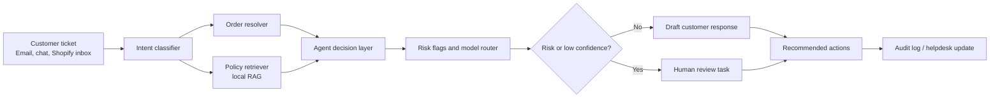

# Workflow Diagram

```mermaid
flowchart LR
    A["Customer ticket<br/>Email, chat, Shopify inbox"] --> B["Intent classifier"]
    B --> C["Order resolver"]
    B --> D["Policy retriever<br/>local RAG"]
    C --> E["Agent decision layer"]
    D --> E
    E --> F["Risk flags and model router"]
    F --> G{"Risk or low confidence?"}
    G -->|No| H["Draft customer response"]
    G -->|Yes| I["Human review task"]
    H --> J["Recommended actions"]
    I --> J
    J --> K["Audit log / helpdesk update"]
```
