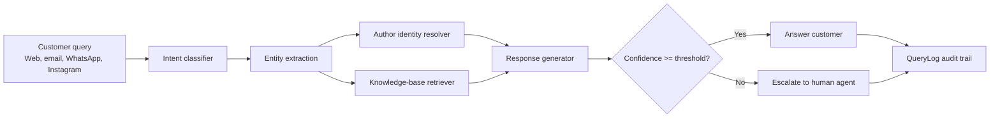

# AI-Powered Customer Support Automation Report

## Selected Use Case

Customer Support Automation for BookLeaf author support. The workflow classifies incoming questions, identifies the author across email/WhatsApp/Instagram/dashboard identifiers, retrieves relevant knowledge-base policy snippets, produces a grounded response, escalates low-confidence cases, and logs every interaction for audit and improvement.

## Prototype Summary

This repository contains a Django POC with:

- Web chat interface for support queries.
- Intent classifier with OpenAI support and deterministic offline fallback.
- Lightweight local RAG using TF-IDF over support articles.
- Author identity resolution across email, phone, Instagram handle, name, dashboard name, and book title.
- Query log dashboard and JSON APIs for operational review.
- Confidence threshold based escalation.

## AI Tool / Platform Evaluation

| Tool | Capabilities | Pricing Snapshot | Scalability | Integration | Limitations | Best Use |
| --- | --- | --- | --- | --- | --- | --- |
| OpenAI GPT-4.1 mini | Strong classification, structured JSON output, tool/function workflows, long context. | Official model page lists GPT-4.1 mini at $0.40 / 1M input tokens, $0.10 cached input, and $1.60 / 1M output tokens. | Hosted API scales well; Batch API and cached input reduce cost. | Python SDK is simple; good fit for Django/FastAPI. | Vendor dependency, data governance review needed, API latency and rate limits. | Primary model for support classification and final answer generation. |
| Anthropic Claude Sonnet / Haiku | Strong reasoning, long-context support, reliable instruction following. | Claude docs list Sonnet 4.6 at $3 / MTok input and $15 / MTok output; Haiku 4.5 at $1 / MTok input and $5 / MTok output. | Enterprise-friendly, available through first-party API and cloud providers. | Easy API integration; useful as second model for complex escalations. | Higher token cost for Sonnet; first-party data residency needs plan review. | Secondary model for high-value escalations and response QA. |
| Google Gemini 2.5 Flash / Flash-Lite | Multimodal inputs, structured outputs, function calling, search grounding, large context. | Gemini pricing lists 2.5 Flash at $0.30 / 1M input and $2.50 / 1M output; Flash-Lite at $0.10 / 1M input and $0.40 / 1M output. | Good for high-volume, low-latency workloads; batch pricing is lower. | Strong if the company already uses Google Cloud. | Model behavior can vary across preview/stable releases; grounding has separate request pricing. | Cost-optimized bulk classification and knowledge-grounded answers. |
| n8n | Low-code workflow automation, webhook triggers, CRM/helpdesk integrations, human-in-the-loop steps. | n8n offers Cloud paid plans and free self-hosted community edition; some enterprise features require paid tiers. | Self-host with queues and Postgres for production; Cloud reduces ops load. | Excellent for connecting Shopify, email, Slack, Sheets, Zendesk/Freshdesk, and webhooks. | Complex workflows can become hard to version; community edition lacks some enterprise governance features. | Orchestration layer around model APIs and business systems. |
| Pinecone | Managed vector database for semantic search and RAG. | Pricing page lists serverless storage around $0.33/GB/month plus read/write units; assistant token pricing is separate. | Designed for large-scale retrieval with managed availability. | Straightforward Python SDK; replaces local TF-IDF when KB grows. | Extra vendor cost; unnecessary for very small KBs. | Production RAG over thousands of support docs and past tickets. |

Sources: [OpenAI GPT-4.1 mini model page](https://developers.openai.com/api/docs/models/gpt-4.1-mini), [Claude pricing docs](https://platform.claude.com/docs/en/about-claude/pricing), [Gemini API pricing](https://ai.google.dev/gemini-api/docs/pricing), [Gemini model capabilities](https://ai.google.dev/gemini-api/docs/models), [n8n platform docs](https://docs.n8n.io/choose-n8n/), [n8n community edition features](https://docs.n8n.io/hosting/community-edition-features/), [Pinecone pricing](https://www.pinecone.io/pricing/).

## Recommended Architecture

For production, use:

- Django or FastAPI service for APIs, authentication, audit logs, and business rules.
- OpenAI GPT-4.1 mini as the default classifier/answer model because it is cost-effective and supports structured output.
- Gemini Flash-Lite or a rules model for cheap high-volume pre-classification.
- Claude Sonnet as an optional escalation/QA model for sensitive or ambiguous conversations.
- Pinecone or Weaviate for semantic KB and historical-ticket retrieval once documents exceed the limits of local search.
- n8n as the integration/orchestration layer for webhooks, support inboxes, Slack alerts, CRM updates, and human approvals.
- PostgreSQL in production instead of SQLite, with background workers for async LLM calls and retries.

## Why These Tools

The prototype keeps the first version intentionally lean: Django, SQLite, deterministic fallback logic, and optional OpenAI. This makes the POC runnable without paid credentials while still demonstrating the real production path. The recommended production stack adds managed vector retrieval and workflow orchestration only where they create clear operational value.

## Estimated Infrastructure Cost

Assumption: 30,000 support queries/month, average 700 input tokens and 180 output tokens per model response.

- OpenAI GPT-4.1 mini model usage: about $17/month before retries, monitoring, and cached prompt savings.
- App hosting: $20-$80/month for a small container or VM.
- PostgreSQL: $15-$50/month for managed starter production database.
- Pinecone starter/serverless usage: often low for a small KB; budget $25-$100/month as document volume grows.
- n8n: $0 self-hosted community edition plus server cost, or paid Cloud if ops time is more expensive than subscription cost.

Expected MVP operating range: roughly $60-$250/month, excluding staff time and any enterprise compliance plans.

## Risks And Limitations

- Hallucination risk: responses must stay grounded in author records and KB snippets.
- Privacy risk: author PII requires encryption, access control, retention policy, and provider data-processing review.
- Misclassification risk: low-confidence and high-value cases should escalate.
- Knowledge freshness: stale KB articles can produce wrong answers even when the model behaves correctly.
- Channel complexity: WhatsApp, Instagram, email, and dashboard identities may conflict, so manual review remains necessary.

## Scaling Plan

1. Replace SQLite with PostgreSQL and add authenticated staff/admin roles.
2. Move LLM calls to a queue with retries, timeouts, cost logging, and dead-letter handling.
3. Replace local TF-IDF with vector search and hybrid keyword+semantic retrieval.
4. Add eval sets from real historical tickets and track precision, escalation rate, containment rate, and CSAT.
5. Add n8n workflows for Slack escalation, helpdesk ticket creation, CRM updates, and weekly analytics.
6. Add model routing: cheap classifier first, stronger model only for low-confidence or high-value queries.

## Demo Walkthrough

Run the app, seed demo data, then open:

- Chat: `http://127.0.0.1:8000/`
- Identity matching: `http://127.0.0.1:8000/identity/`
- Logs: `http://127.0.0.1:8000/logs/`
- Health check: `http://127.0.0.1:8000/api/health`

Suggested demo prompts:

- `Is my book live yet?` with `sara.johnson@example.com`
- `When will I get royalty payment?` with `aarav.mehta@example.com`
- `Where is my author copy?` with `nisha.verma@example.com`
- `blue triangle banana` to show low-confidence escalation

For the video, show the chat response, the identity matcher, and the log dashboard after two or three queries.
